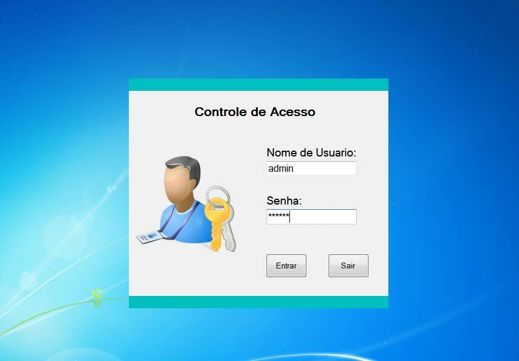
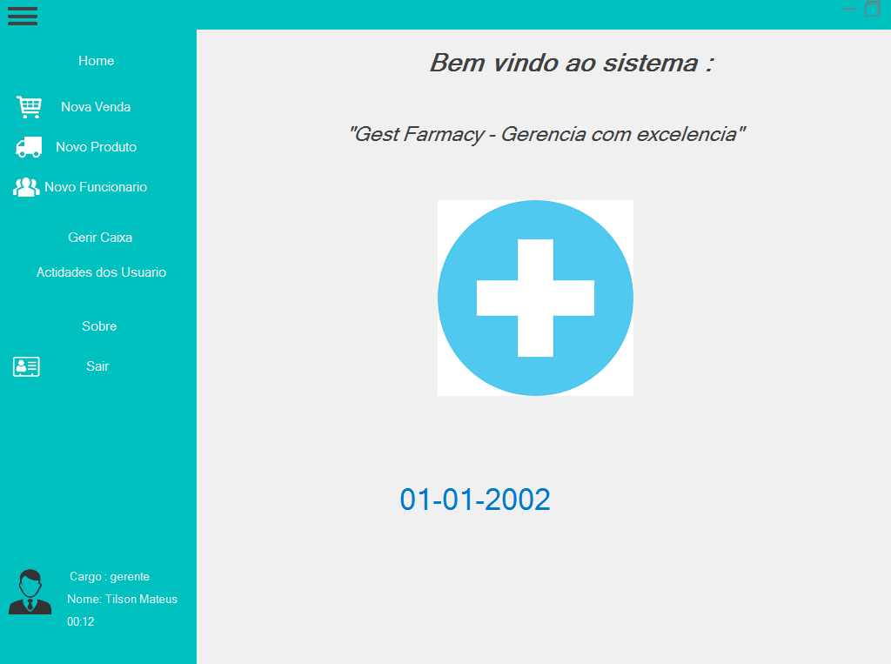
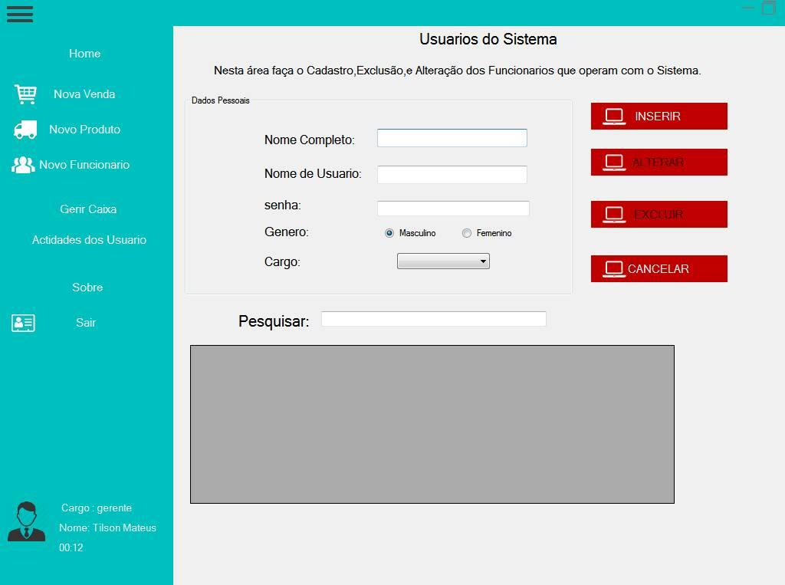
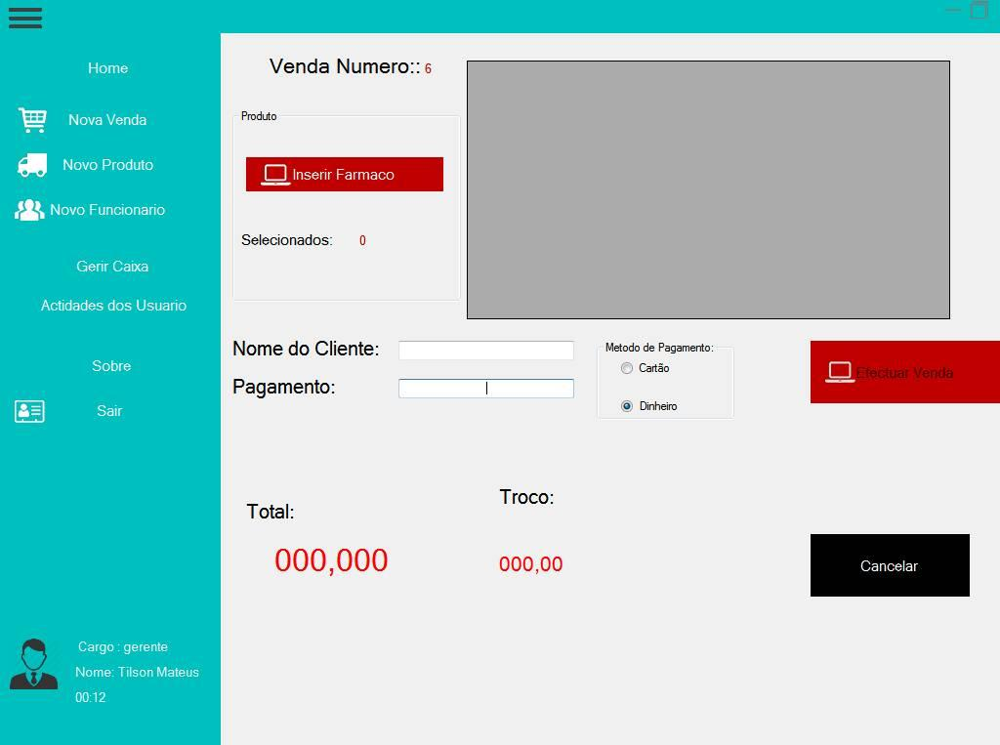
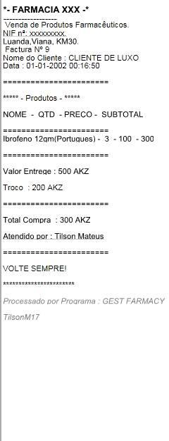

# farmacia-sharp

Este é um sistema Desktop de vendas destinado para farmacias.

Este foi construido usando a Linguagem **C#**, para banco de Dados foi usado o **SQL COMPACT EDTION(SQLCE)**, uma versão minificada do **SQLSERVER**, a grosso modo podemos o comparar com o SQLlite. 

Este projecto foi feito numa fase que eu estava a apreender a Linguaguem C#, Windows Forms Apps.

Já foi usada para fins comerciais, mas actualmente **é simplismente para fins ***didaticos*** Não esta em condições de ser usada pra fins comerciais** 

## Caracteristicas

As suas principais funções são:

 - Registro de Produtos.
 - Inserção de Funcionarios.
 - Controle de Actividades de Funcionario.
 - Efectuação de Vendas.
 - Balanço Semanal/Mensal das Contas.
 - Emissão de Factura.
 -Registro de Vendas.
 -Separação de Responsabilidades(Admin/Funcionario).

## Screenshots

## Como rodar?

Faça download ou clone e abra no seu Visual Studio.

Na Localisação `Gest Farmacy\bin\DataBaseFiles\db_framcia.sdf` contem o ficheiro da base de Dados.

**Nota:** Pra rodar o projecto voçe precisa de ter em seu pc a DLL `System.Data.SqlServerCe`, sem ela este projecto não vai rodar, sem ela não existe base de dados e dara ERRO.

Se tiver uma duvida abra uma issue, e seja Feliz !!!